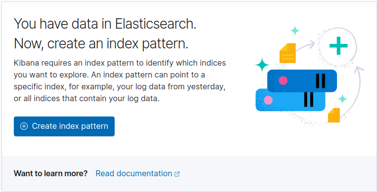
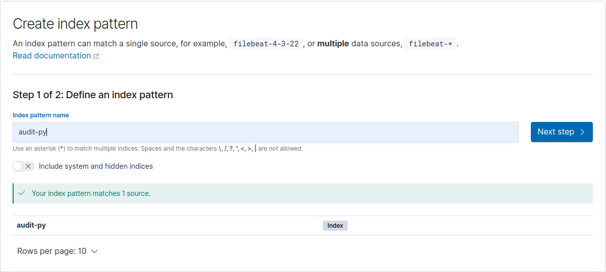
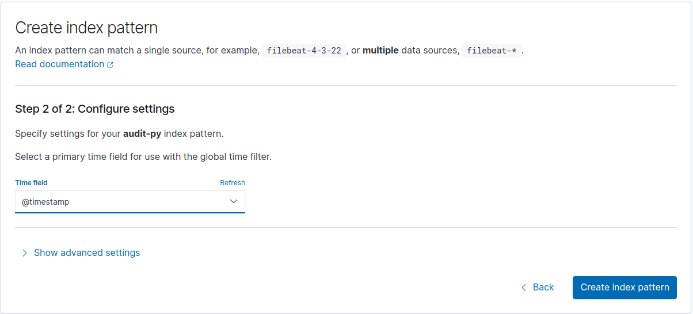
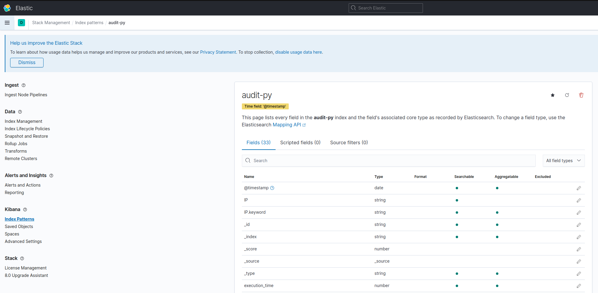
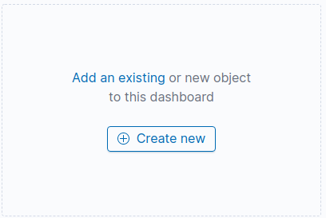
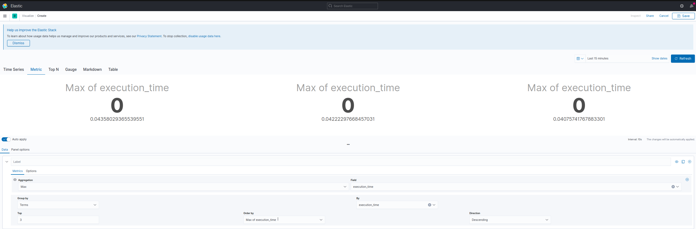
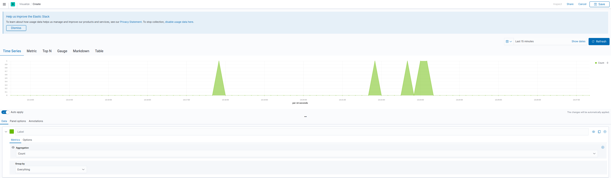
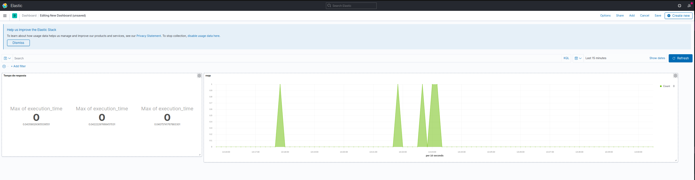
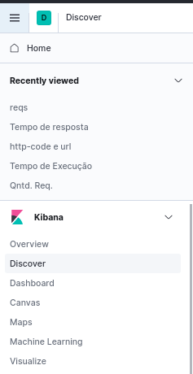

# wb-cat-api

## Requisitos

Para usar esse repositório é necessário seguir os pré-requisitos listados abaixo:

| Name 	| Version 	|
|:----:	|---------	|
| Ubuntu | 18.04 + |
| Docker | 19.03 + |
| git    | 02.17 + |
| Docker Compose | 01.17 + |
| RAM | 8Gb +|

## Arquitetura da aplicação

Este projeto foi criado usando:
- Flask             : Um framework web para ser usado junto ao Python para processar as requisições web
- Python            : Usado para criar o APP que popula o banco de dados usando a API de Gatos
- MySQL             : Banco de Dados
- ElasticSearch     : Indexador de documentos
- Kibana            : Interface Web para o Elastic
- Shell Script      : Script de inicialização e configuração inicial do Elastic

Usando o Flask foi criado toda a aplicação WEB com algumas funções como por exemplo, buscar um gato de uma determinada raça, listar todas as origens de gatos, buscar imagem de gatos com chapéus dentre outras funções.

Usando o Python criamos o script que irá popular nosso banco de dados consumindo a API de Gatos

MySQL foi usado para armazenar todas as informações sobre os gatos 

ElasticSearch foi usado como ferramenta de Log e Auditoria 

Kibana foi usado para que o usuário possa interagir com os dados coletados e visualizar as LOGS que o sistema gerou e para acompanhar todas as atividades do sistema no Dashboard de 'monitoria'

OBS: No elastic foi feito algumas mudanças em relação aos MAPPINGS para se adequar há aplicação a mudança no caso ocorreu no campo @timestamp que é criado como 'texto' e nós alteramos para date.

## Como usar

Basta executar o script na raiz do projeto [wb-cat.sh](./wb-cat.sh) esse script irá fazer toda a preparação e inicalizado do **ambiente**

## Manual

1. Execute o script na raiz do projeto como usuário ROOT
2. Aguarde até o término do script
3. Para acessar a aplicação existe 2 modos sendo eles:
4. Via Postman:
4.1. Com o postman aberto faça a importação do contéudo da pasta [postman](postman/wb-cat-api.postman_collection.json)
4.2. Após a importação você tera na barra lateral todas as requisições que a aplicação faz (e dentro delas existe um exemplo de como usar)
5. Via browser
5.1 Abra seu navegador e acesse **0.0.0.0:5000**
5.2 Abaixo segue a tabela com as urls que podem ser acessadas (endpoints que possuem ações):
|             URL             	| Method 	|
|:---------------------------:	|--------	|
| /breeds                     	| GET    	|
| /breeds/<nome da raça>      	| GET    	|
| /origin                     	| GET    	|
| /origin/<origem>            	| GET    	|
| /temperament                	| GET    	|
| /temperament/<temperamento> 	| GET    	|
| /hat                        	| GET    	|
| /glasses                    	| GET    	|
|                             	|        	|

6. Para acessar as Logs e os Dashboard acesse **0.0.0.0:5601**
7. Siga os passos abaixo para criar um **index patter e o dashboard**

8. Na lateral esquerda clique em dashboard, depois clique no botão **Create index patters**

9. No campo de texto digite **audit-py** conforme a imagem abaixo e clique em **Next Step**

10. Selecione a opção **@timestamp**

11. Você irá ver uma tela semelhante a essa

12. Repita o passo 8 para ver a seguinte tela


13. Após clicar em **Create new** preencha os campos conforme a imagem abaixo para criar uma analise de **Maior tempo de resposta**

14. Caso queira pode se usar a imagem abaixo como referencia para a criação de uma analise de **quantidade de requisições**

15. No final você terá um dashboard semelhante a esse.

16. Pode-se usar os exemplo citados nos passos 14 e 15 para a criação de diversos dashboard interativos.
17. Para ver as logs que a aplicação gerou basta acessar o menu lateral e escolher a opção **Discover**


18. Você verá uma tela semelhante a essa onde os LOGS são exibidos de acordo com o horário em que a requisição foi feita

19. Há também como ver os LOGS via terminal basta executar o comando 
```bash
docker logs -f 


## Obrigado :)
Wallace Bruno Gentil
w.brunoge@gmail.com
